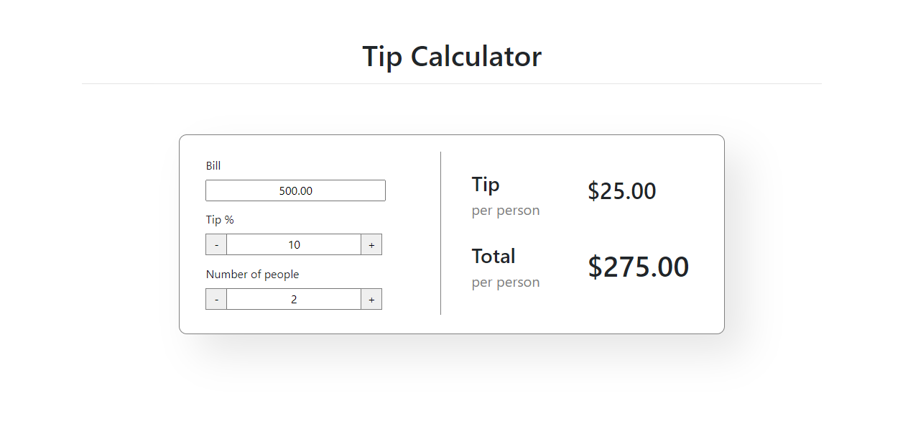

# Tip Calculator

## Test cases
1. Bill amount field should only accept decimal and float numbers
2. Tip percent field should only accept decimal numbers
3. Number of People field should only accept decimal numbers
4. Bill amount should not be in negative
5. Tip percent should not be less than 0 and greater than 100
6. Number of people should be greater than equal to 1
7. check if number of people is 1 it should not show per person in tip and total 
8. Plus button should increase the value by 1
9. Minus button should decrease the value by 1
